## **LOAD BALANCER SOLUTION WITH NGINX AND SSL/TLS**

</br>

### **CONFIGURE NGINX AS A LOAD BALANCER**

</br>

1. Create an EC2 VM based on Ubuntu Server 20.04 LTS and name it `Nginx LB ` (do not forget to `open TCP port 80 `for HTTP connections, also open `TCP port 443` – this port is used for secured HTTPS connections)

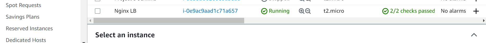


</br>

1. Update `/etc/hosts` file for `local DNS with Web Servers`’ names (e.g. `Web1` and `Web2`) and their `local IP addresses`

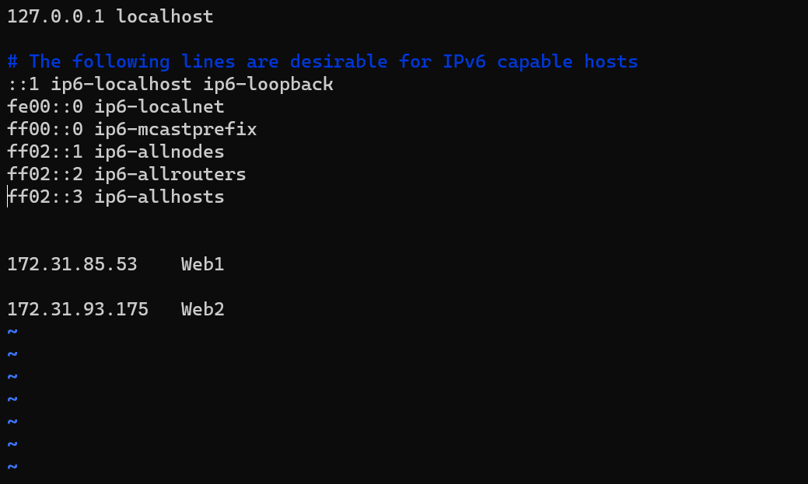

**Update the instance and Install Nginx**

`sudo apt update`

`sudo apt install nginx`

`sudo nginx -v`

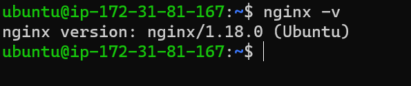


**Configure Nginx LB using Web Servers’ names defined in `/etc/hosts`**


Open the default nginx configuration file

`sudo vi /etc/nginx/nginx.conf`


#insert following configuration into `http section`

```
 upstream myproject {
    server Web1 weight=5;
    server Web2 weight=5;
  }

server {
    listen 80;
    server_name www.domain.com;
    location / {
      proxy_pass http://myproject;
    }
  }

#comment out this line
#       include /etc/nginx/sites-enabled/*;

```
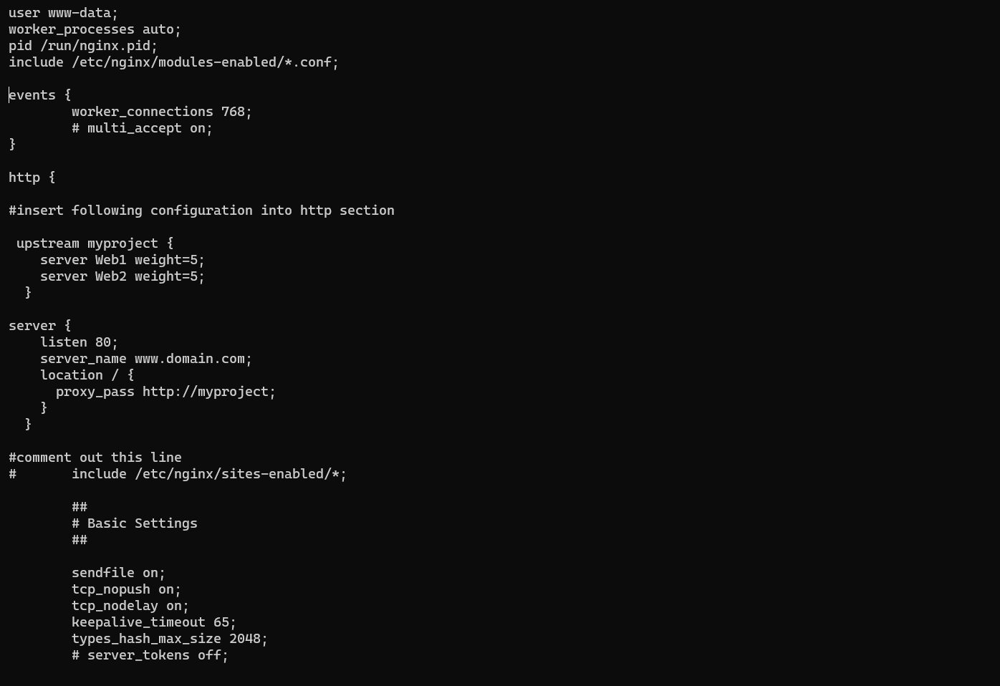


Restart Nginx and make sure the service is up and running

`sudo systemctl restart nginx`

`sudo systemctl status nginx`

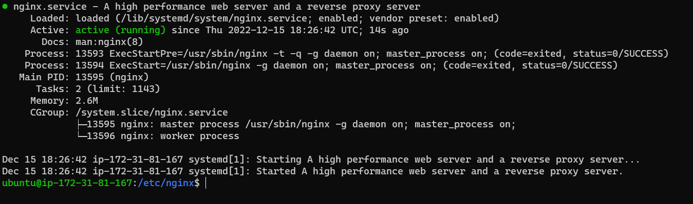

</br>

Open the nginx Load Balancer in a browser

`http://lb-nginx-Server-Public-IP-Address-or-Public-DNS-Name/index.php` 


http://3.85.13.18/index.php

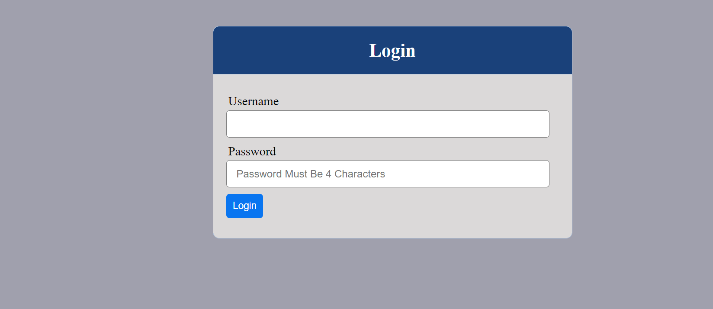

</br>

### **REGISTER A NEW DOMAIN NAME AND CONFIGURE SECURED CONNECTION USING `SSL/TLS CERTIFICATES`**

</br>

In order to get a `valid SSL certificat`e – you need to register a `new domain name`, you can do it using any `Domain name registrar` – a company that manages reservation of domain names. The most popular ones are: `Godaddy.com, Domain.com, Bluehost.com.`

</br>

1. **Register a new domain name with any registrar of your choice in any domain zone `(e.g. .com, .net, .org, .edu, .info, .xyz or any other)`**

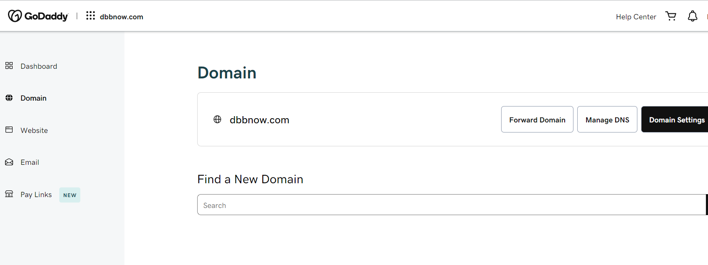

</br>

2. **`Assign an Elastic IP` to your `Nginx LB server` and `associate your domain name with this Elastic IP`**

You might have noticed, that every time you restart or stop/start your EC2 instance – you get a new public IP address. When you want to associate your domain name – `it is better to have a static IP address that does not change after reboot`. 

`Elastic IP` is the solution for this problem, learn how to allocate an Elastic IP and associate it with an EC2 server [on this page.](https://docs.aws.amazon.com/AWSEC2/latest/UserGuide/elastic-ip-addresses-eip.html)

</br>


</br>

3. **Update the `A record `in your registrar to point  to `Nginx LB using Elastic IP address`**
   
</br>

   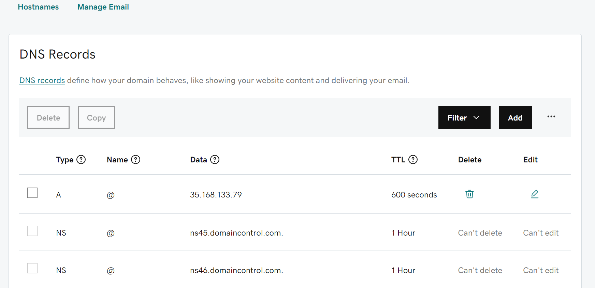

   </br>
   
Learn how to associate your domain name to your Elastic IP [on this page.](https://medium.com/progress-on-ios-development/connecting-an-ec2-instance-with-a-godaddy-domain-e74ff190c233)


Side Self Study: Read about different DNS record types and learn what they are used for.

Check that your `Web Servers` can be reached from your browser using new domain name using HTTP protocol – `http://<your-domain-name.com>`

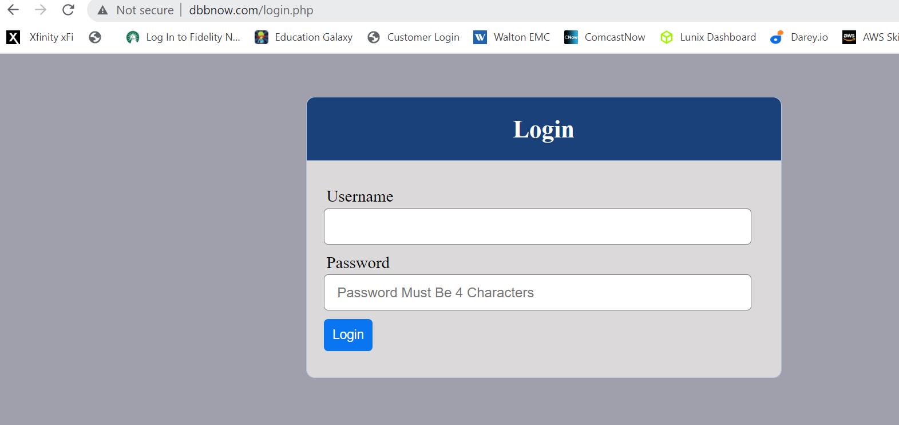

</br>

4. **`Configure Nginx` to recognize your new domain name**

Update your `nginx.conf` with `server_name www.<your-domain-name.com>` instead of `server_name www.domain.com`


`sudo vi /etc/nginx/nginx.conf`

</br>

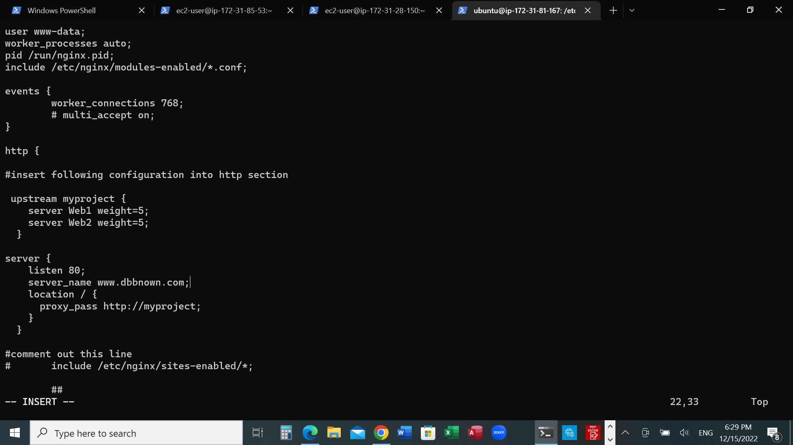

</br>

5. Install `certbot` and request for an `SSL/TLS certificate`

      ### **Option 1: use snap**

 </br>

Make sure `snapd service` is `active` and running

    sudo systemctl status snapd


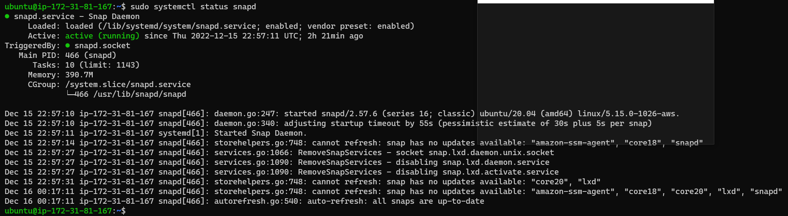


Install certbot

      sudo snap install --classic certbot

  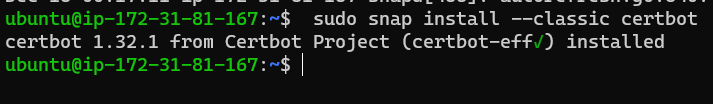


Request your certificate (just follow the `certbot` instructions – you will need to choose which `domain` you want your certificate to be issued for, `domain name will be looked up from nginx.conf` file so make sure you have updated it on step 4).

    sudo ln -s /snap/bin/certbot /usr/bin/certbot

    sudo certbot --nginx
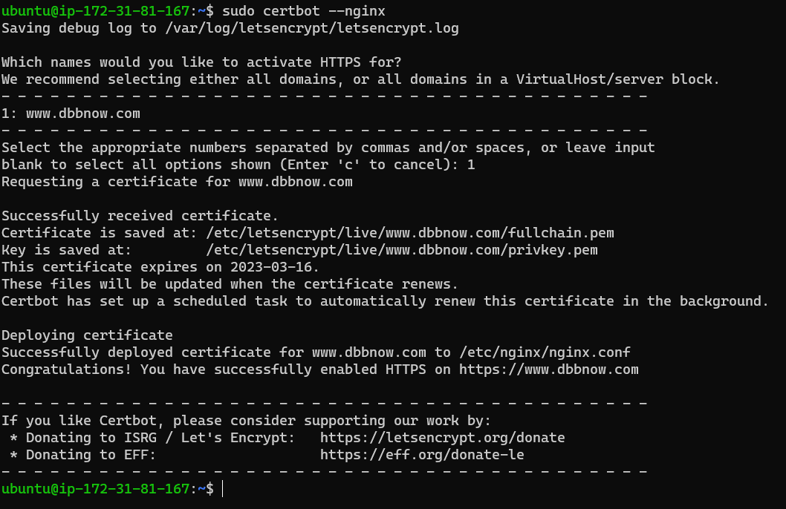

</br>

### **Option 2: use apt**

</br>

  **1. install certbot**

   `sudo apt install --certbot -y`

  **2. install python dependencies**

    sudo apt install python3-certbot-nginx

  **3. Request certificate for your website**


    sudo certbot --nginx -d <domain-name> -d www.<domain-name>

Exemple:

   `sudo certbot --nginx -d dbbnow.com -d www.dbbnow.com`

  **4. Restart nginx**

    sudo systemctl restart nginx

</br>

Test secured access to your Web Solution by trying to reach `https://<your-domain-name.com>`

You shall be able to access your website by using `HTTPS protocol` (that uses `TCP port 443`) and see a `padlock pictogram` in your browser’s search string.

Click on the padlock icon and you can see the details of the certificate issued for your website.

</br>

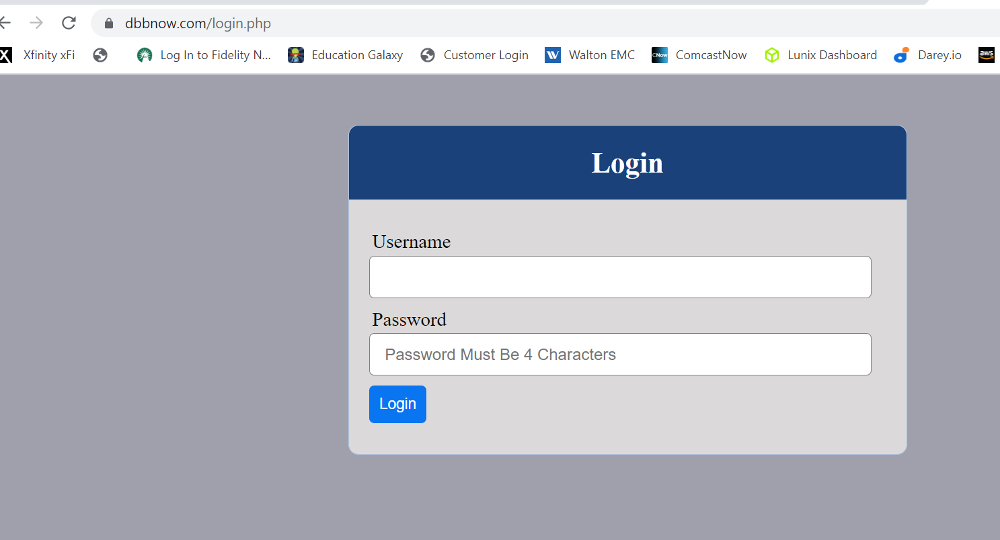

</br>

1. **Set up periodical renewal of your SSL/TLS certificate**

By default, `LetsEncrypt certificate is valid for 90 days`, so it is recommended to `renew it at least every 60 days` or more frequently.

You can test renewal command in dry-run mode

    sudo certbot renew --dry-
    
   </br> 

  Best pracice is to have a scheduled job that to run `renew` command periodically.
  
   Let us `configure a cronjob` to run the command `twice a day`.

To do so, lets `edit the crontab file` with the following command:

    crontab -e

Add following line in the crontab file:


      * */12 * * *   root /usr/bin/certbot renew > /dev/null 2>&1

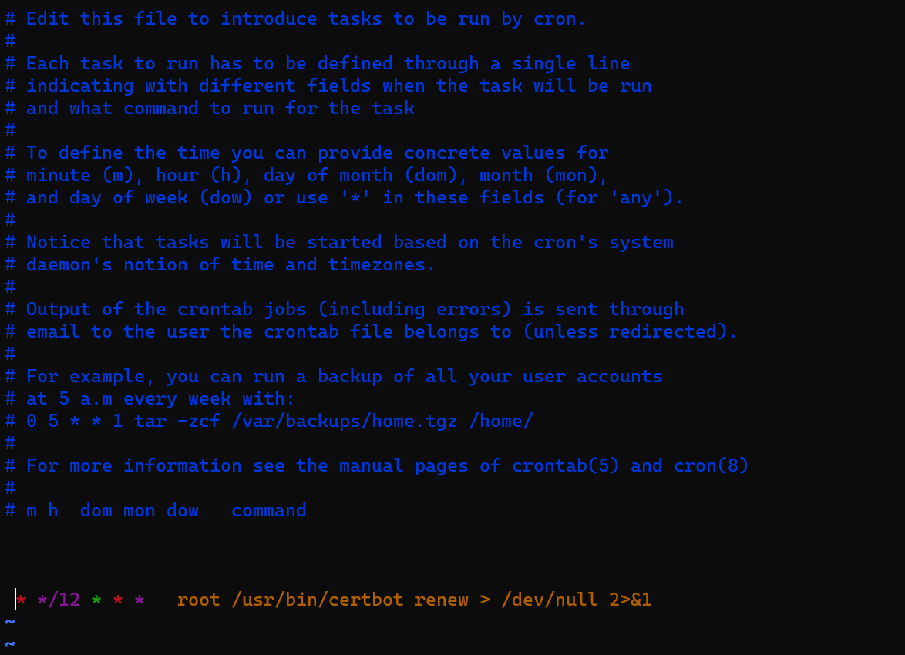

Side Self Study: Refresh your cron configuration knowledge by watching [this video.](https://www.youtube.com/watch?v=4g1i0ylvx3A)


You can also use this handy online [cron expression editor](https://crontab.guru/)
